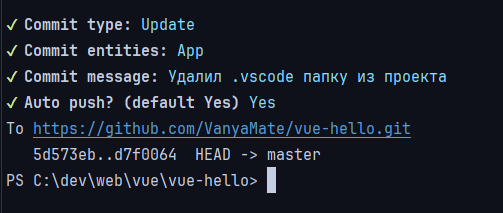

# Commiter

Инструмент для создания однообразных коммитов




Установка:

```shell
npm i @vanyamate/commiter
```

Для начала нужно создать конфиг c типом:

```typescript
export type CommiterListOption =
    Array<string | Record<string, string>>
    | Record<string, string>;

export type CommiterOptions = {
    types: CommiterListOption;
    entities: CommiterListOption;
    entitiesSeparator?: string;         // Default: ', '
    postfixes?: CommiterListOption;
    postfixesSeparator?: string;        // Default: ', '
    pattern: string;
    gitFolder: string;
    gitRemoteRepositoryName?: string;
    gitPushDefault?: boolean;           // Default: false
}
```

Например:

```typescript
import { CommiterOptions } from './Commiter.types';


const __dirname = import.meta.dirname;
const gitFolder = resolve(__dirname, '..', '..');

const config: CommiterOptions = {
    types                  : {
        'Fix': 'Fix 💡',
        'Up' : 'Update ♥',
    },
    entities               : [ 'App', 'User', { Comm: 'Commentary' } ],
    entitiesSeparator      : ', ',
    postfixes              : {
        'Unit tests'     : 'unit',
        'Build'          : 'build',
        'Playwright'     : 'playwright',
        'Telegram notify': 'tg',
    },
    postfixesSeparator     : '%',
    pattern                : `{{type}} : {{entities}} - {{message}}{}`,
    gitFolder              : gitFolder,
    gitRemoteRepositoryName: 'origin',
    gitPushDefault         : true,
};
```

Типы `types`, сущности `entities` и `postfixes` можно указывать как:

- Массив строк
- Массив строк + объекты с одним значением
- Объект со всеми типами, где ключ - то что покажется в консоли, значение - то что будет в коммите

Паттерн указывается как строка.

- `{{type}}` - заменится на указанный тип из списка `types`
- `{{entities}}` - заменится на выбранные сущности из `entities`
- `{{message}}` - заменится на введенное сообщение
- `{{postfixes}}` - заменится на выбранные `postfixes`. Можно писать как `{}` или что угодно другое
  внутри `{{ТУТ postfixes И ТУТ}}`. Тогда то что перед `postfixes` и после - вставится перед и после всех постфиксов
  соответственно. Допустим у нас есть строчка: `{{type}} : {{entities}} - {{message}}{{%postfixes%_%}}`, и мы выбрали
  постфиксы `tg` и `notify`. Тогда строчка `{{%postfixes%_%}}` заменится на `%tg, notify%_%`. Если мы не выберем
  ничего - тогда никаких `%` и `%_%` не будет. (работает только с postfixes так как они не являются обязательными)

`gitFolder` - папка в которой будут вызываться команды `git add .` и `git commit -m /сообщение/`

`gitRemoteRepositoryName` - имя git репозитория который вы указали через `git remote add [это]`.
Например: `origin`. Если этот параметр указан, то добавится поле выбора автоматического push-а. Без него автоматический
push работать не будет.

`gitPushDefault` - `true` означает, что по умолчанию будет `git push /gitRemoteRepositoryName/ HEAD` - `y` (Yes),
иначе `n` (No)

`entitiesSeparator` - как объединятся выбранные `entities`

`postfixesSeparator` - как объединятся выбранные `postfixes`

Дальше создать эксемпляр в который передать конфиг коммитера и вызвать метод `create`

```typescript
import { Commiter } from '@vanyamate/commiter';
import config from './config';


new Commiter(config).create();
```

Для использования можно создать скрипт в `package.json`

```text
"commit": "tsx utils/git/commiter.ts" 

или

"commit": "node utils/git/commiter.js"
```

и вызывать как

```shell
npm run commit
```